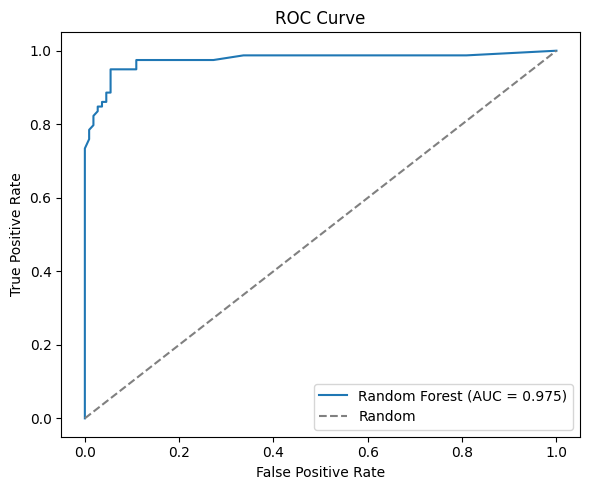
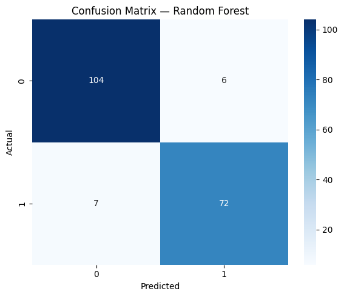
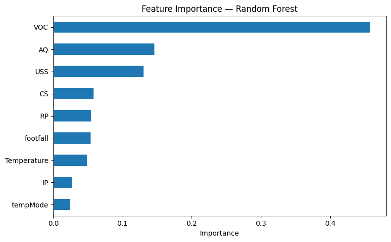

# Machine Failure Prediction

Binary classification of industrial machine failures from multi-sensor data
using Logistic Regression and Random Forest, with evaluation via ROC-AUC,
confusion matrix, and feature importance analysis.

---

## Problem

Unexpected machine failures cause costly downtime, safety hazards, and
disrupted production. This project explores whether sensor readings —
temperature, vibration, air quality, and other signals — can predict
machine failure **before** it occurs.

---

## Dataset

- **Size:** 944 rows, 9 sensor features, 1 binary target (`fail`)
- **Features:** footfall, tempMode, AQ, USS, CS, VOC, RP, IP, Temperature
- **Target:** `fail` — 1 = machine failure, 0 = no failure
- **Class balance:** ~42% failures / ~58% no failure
- **Source:** [paste Kaggle dataset URL here]
- **License:** [paste license, e.g., CC0 Public Domain]

### Feature Description

| Feature | Description |
|---|---|
| footfall | Number of people/objects passing the machine |
| tempMode | Temperature mode setting of the machine |
| AQ | Air quality index near the machine |
| USS | Ultrasonic sensor proximity measurement |
| CS | Current sensor reading (electrical current) |
| VOC | Volatile organic compounds level |
| RP | Rotational position / RPM |
| IP | Input pressure |
| Temperature | Operating temperature of the machine |

### Limitation

This dataset is **tabular** — each row is an independent snapshot. It does
not contain time-series information, so it cannot model gradual degradation
over time. For temporal predictive maintenance, the **AI4I 2020** dataset
is the standard benchmark.

---

## Method

1. **Preprocessing**
   - Stratified 80/20 train/test split (755 train / 189 test)
   - Standard scaling of features (`StandardScaler`)

2. **Models trained**
   - Majority-class baseline (`DummyClassifier`)
   - Logistic Regression (`max_iter=1000`)
   - Random Forest (`n_estimators=100`)

3. **Evaluation metrics**
   - Accuracy, Precision, Recall, F1-score, ROC-AUC
   - Confusion matrix
   - 5-fold cross-validation

---

## Results

| Model | Accuracy | Precision | Recall | F1 | ROC-AUC |
|---|---|---|---|---|---|
| Majority Baseline | 0.583 | 0.000 | 0.000 | 0.000 | 0.500 |
| Logistic Regression | [fill] | [fill] | [fill] | [fill] | [fill] |
| **Random Forest** | **0.931** | **0.923** | **0.911** | **0.917** | **0.975** |

**Random Forest** was selected as the final model based on the highest F1
and ROC-AUC. On the test set, it missed 7 failures (false negatives) and
raised 6 false alarms (false positives).

### ROC Curve

### Confusion Matrix

### Feature Importance

---

## Key Findings

- **VOC** (volatile organic compounds) was the most predictive feature
  (importance ≈ 0.45), followed by **AQ** (air quality) and **USS**
  (ultrasonic proximity). This aligns with physical intuition: chemical
  degradation releases volatile compounds, and air quality degrades before
  mechanical failure.
- **AQ showed strong linear correlation with failure (r = 0.58) but modest
  Random Forest feature importance** — the tree model captured non-linear
  interactions that Pearson correlation alone cannot detect.
- The model achieved **93.1% accuracy** and **ROC-AUC 0.975**, demonstrating
  that sensor fusion is a viable approach for early failure detection.

---

## Repository Structure

    Machine_Failure_prediction_model/
    ├── README.md
    ├── requirements.txt
    ├── machine_failure_prediction.ipynb    # main notebook
    ├── report.pdf                          # detailed project report
    ├── presentation.pdf                    # project presentation
    ├── roc_curve.png
    ├── confusion_matrix.png
    ├── feature_importance.png
    └── data/
        └── README.md                       # dataset source + license

---

## Reproduce

### In Google Colab (recommended)

1. Open `machine_failure_prediction.ipynb` in Colab
2. Download the dataset from [Kaggle link] and upload it to `/content/`
   (see `data/README.md` for details)
3. Run all cells

### Locally

    git clone https://github.com/Sakshi-zz/Machine_Failure_prediction_model.git
    cd Machine_Failure_prediction_model
    pip install -r requirements.txt
    jupyter notebook machine_failure_prediction.ipynb

---

## Requirements

    pandas
    numpy
    scikit-learn
    matplotlib
    seaborn
    jupyter

---

## Reports

- [Full report (PDF)](report.pdf)
- [Presentation (PDF)](presentation.pdf)

---

## Future Work

- Evaluate on the **AI4I 2020** dataset (standard predictive maintenance
  benchmark with 10,000 rows and severe class imbalance ~3.4%)
- Extend to **time-series models** (LSTM, Temporal CNN) for degradation
  tracking
- Add **SHAP values** for model interpretability
- Perform **threshold tuning** to optimize the precision-recall trade-off
  for safety-critical deployment

---

## References

1. [Dataset source — paste Kaggle citation here]
2. Matzka, S. (2020). *AI4I 2020 Predictive Maintenance Dataset*. UCI
   Machine Learning Repository.
   https://archive.ics.uci.edu/ml/datasets/AI4I+2020+Predictive+Maintenance+Dataset
3. [Add 1–2 more papers on predictive maintenance if you used any]

---

## Author

**Sakshi Rana**
- GitHub: [@Sakshi-zz](https://github.com/Sakshi-zz)
- Email: [your email]
- LinkedIn: [your LinkedIn]

---

## License

This project is licensed under the MIT License. See `LICENSE` for details.
